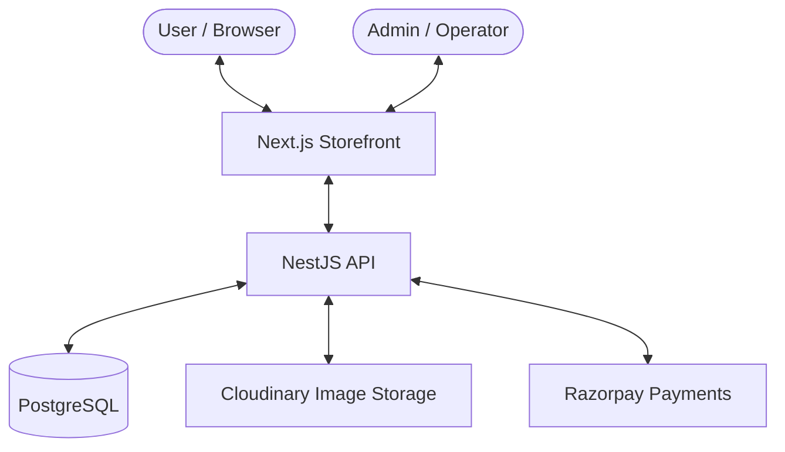

# 🌿 Elvaré — Ethereal Fashion E-Commerce

> **Editorial Luxury meets Modern Tech.** A premium, full-stack fashion platform featuring a sleek dark-themed storefront and a powerful operator dashboard.

[](https://nextjs.org/)
[](https://nestjs.com/)
[](https://tailwindcss.com/)
[](https://www.prisma.io/)

---

## ✨ The Vision

Elvaré is designed to captivate at first glance. It combines a high-end, editorial aesthetic with a lightning-fast user experience. The interface is a carefully crafted dark mode universe punctuated by subtle green glow effects, creating an immersive, premium shopping atmosphere.

### 🎨 Design Vibe
- **Color Palette**: Dark surfaces (`#0C0D0C`) with ethereal green accents (`#22C55E`) and subtle glows.
- **Typography**: *Cormorant Garamond* for that editorial luxury feel, paired with *DM Sans* for clean, modern readability.

---

## 🏗️ How It Works (Architecture)



---

## 🚀 Tech Stack

### Storefront (Frontend)
- **Framework**: Next.js 14+ (App Router) for SSR & dynamic routing.
- **Styling**: Tailwind CSS 4.0 for a custom, highly-tailored design system.
- **Animations**: Framer Motion for smooth, editorial-grade transitions.
- **State**: Zustand for lightweight, performant Cart & Wishlist management.
- **Auth**: NextAuth.js (Credentials Provider).

### Core (Backend)
- **Framework**: NestJS (Node.js) for a structured, scalable API.
- **Database**: PostgreSQL with **Prisma ORM** for type-safe database queries.
- **Storage**: Cloudinary for high-performance image optimization and uploads.
- **Payments**: Razorpay integration for seamless checkouts.

### Infrastructure
- **Monorepo**: Managed with `pnpm` workspaces for clean separation of concerns.

---

## 💎 Key Features

### The Storefront Experience
- **Ethereal Aesthetic**: Custom dark-mode palette with glowing green accents.
- **Smart Browsing**: Advanced filtering by category, price, and attributes with real-time updates.
- **Interactive Cart**: Seamless drawer-based cart experience.
- **Secure Checkout**: Full Razorpay integration for safe and quick transactions.

### The Operator Command Center (Admin)
- **Executive Dashboard**: Real-time analytics overview of revenue, orders, and inventory.
- **Media-Rich Management**: Direct Cloudinary uploads for product imagery.
- **Order Tracking**: Full lifecycle management of customer orders.

---

## 🚦 Getting Started

### Prerequisites
- Node.js 18+
- pnpm 8+
- PostgreSQL instance

### Installation

1. **Clone the repository:**
   ```bash
   git clone https://github.com/Dzyu-cyber/elvare-fullstack-website.git
   cd elvare-fullstack-website
   ```

2. **Install dependencies:**
   ```bash
   pnpm install
   ```

3. **Environment Setup:**
   Create `.env` in `apps/api` and `.env.local` in `apps/web` (see `.env.example`).

4. **Run Development Servers:**
   ```bash
   pnpm dev
   ```
   This will start both the Next.js frontend and NestJS backend concurrently!

---

## 📁 Project Structure

```text
├── apps
│   ├── api          # NestJS Backend (Port 4000)
│   └── web          # Next.js Frontend (Port 3000)
├── package.json     # Root workspace configuration
└── pnpm-workspace.yaml
```

---

> Built with precision and passion. 🖤
